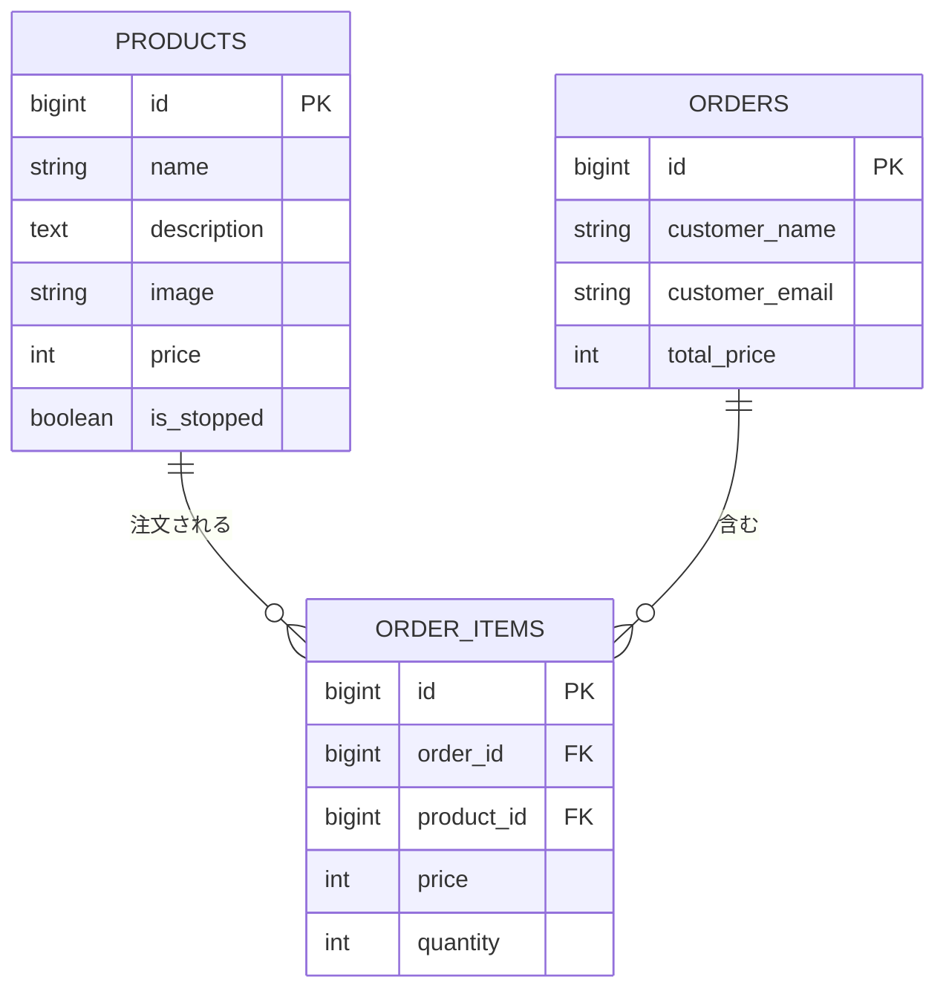

# 商品注文アプリ テーブル設計

**関連要件:** `docs/requirements/product-ordering-app.md`

## ER図

## products

| カラム | 型 | 制約 | 備考 |
|---|---|---|---|
| id | BIGINT UNSIGNED | PK | |
| name | VARCHAR(255) | NOT NULL | 商品名 |
| description | TEXT | NOT NULL | 商品説明 |
| image | VARCHAR(255) | NOT NULL | 商品画像パス |
| price | INT | NOT NULL | 単価（円、小数なし） |
| is_stopped | BOOLEAN | NOT NULL, DEFAULT FALSE | 販売停止フラグ |
| created_at / updated_at | TIMESTAMP | NULLABLE | |

## orders

| カラム | 型 | 制約 | 備考 |
|---|---|---|---|
| id | BIGINT UNSIGNED | PK | |
| customer_name | VARCHAR(255) | NOT NULL | 注文者氏名 |
| customer_email | VARCHAR(255) | NOT NULL | 注文者メールアドレス |
| total_price | INT | NOT NULL | 合計金額 |
| created_at / updated_at | TIMESTAMP | NULLABLE | |

## order_items

| カラム | 型 | 制約 | 備考 |
|---|---|---|---|
| id | BIGINT UNSIGNED | PK | |
| order_id | BIGINT UNSIGNED | NOT NULL, FK(orders.id) ON DELETE CASCADE | 注文明細は注文に従属するため |
| product_id | BIGINT UNSIGNED | NOT NULL, FK(products.id) ON DELETE RESTRICT | 過去の注文記録保護のため商品削除を禁止 |
| price | INT | NOT NULL | 注文時の単価（スナップショット） |
| quantity | INT | NOT NULL | 数量（1〜99、アプリ側で検証） |
| created_at / updated_at | TIMESTAMP | NULLABLE | |

## 注文履歴の実現方法

テーブルにセッション用カラムは追加せず、注文確定成功時にLaravelのセッションへ`order_id`を配列で追記し、注文履歴画面ではそのIDに紐づく`orders`を取得する（カートと同じくSession活用）。

## 未決事項

なし
